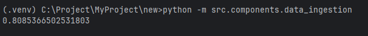
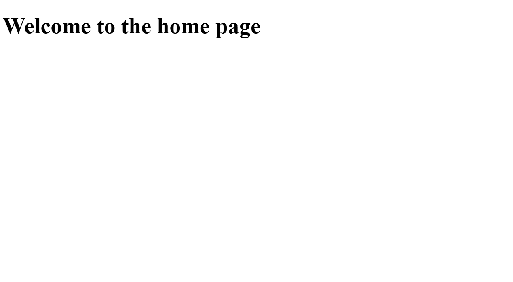
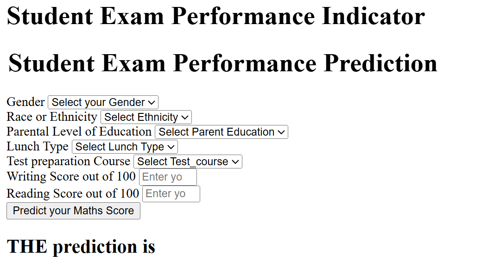
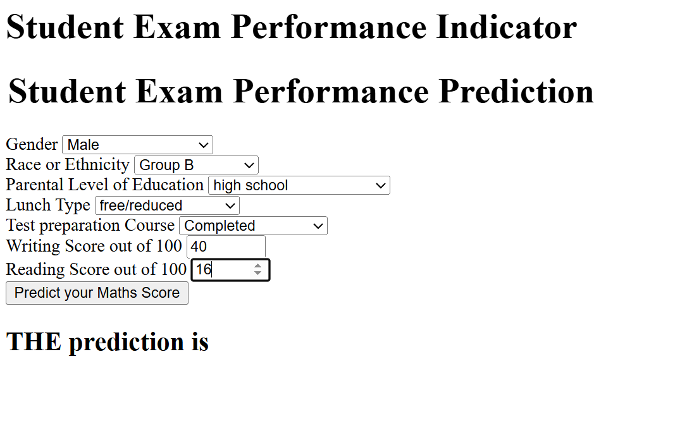
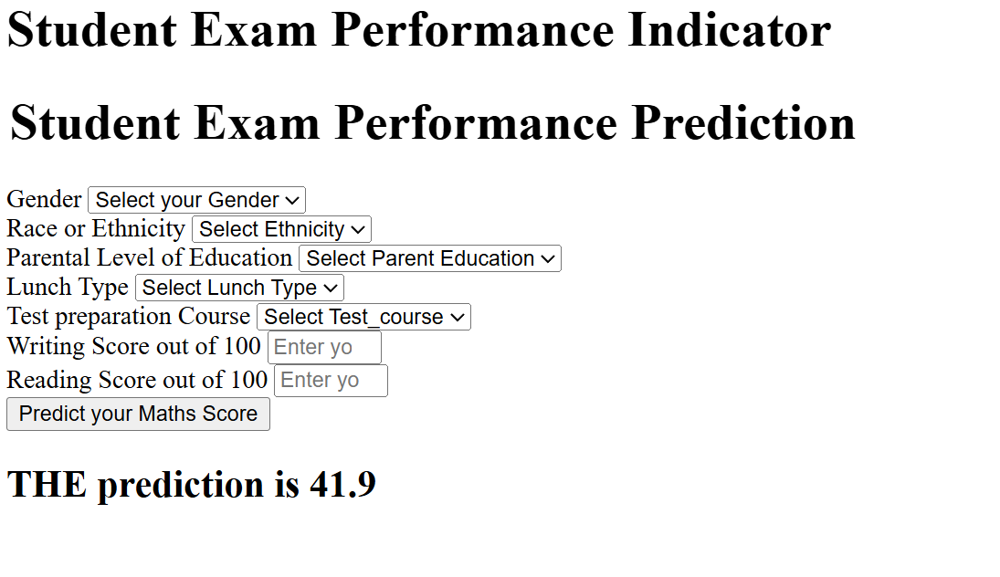

## Students Performance in Exams dataset

1. Description of the Dataset
The Students Performance in Exams dataset, available at https://www.kaggle.com/datasets/spscientist/students-performance-in-exams.

Contains data on students’ academic performance in various subjects, along with demographic and socio-economic factors. 

Size: Approximately 1,000 rows (exact count varies slightly in analyses, typically 1,000 students).

2. Features :

- Gender: Male or female.
- Race/Ethnicity: Categorized into groups (e.g., Group A, B, C, D, E).
- Parental Level of Education: Levels such as high school, some college, associate’s degree, bachelor’s degree, or master’s degree.
- Lunch: Standard or free/reduced (proxy for socio-economic status).
- Test Preparation Course: Completed or none.
- Reading Score: Score in reading (0–100).
- Writing Score: Score in writing (0–100).
- Math Score: Score in mathematics (0–100). ( This is my target value)

## Performance

## My deployment:

